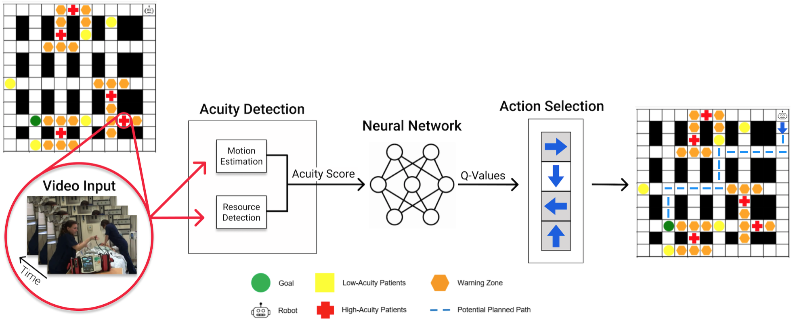
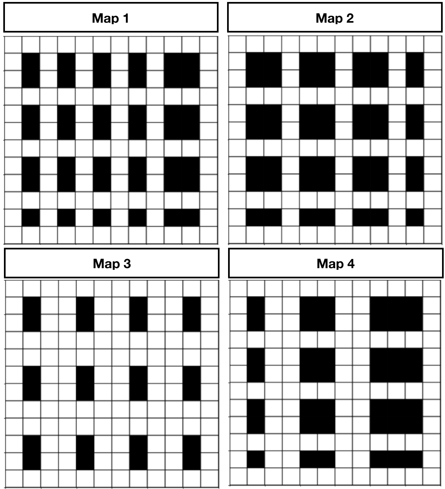
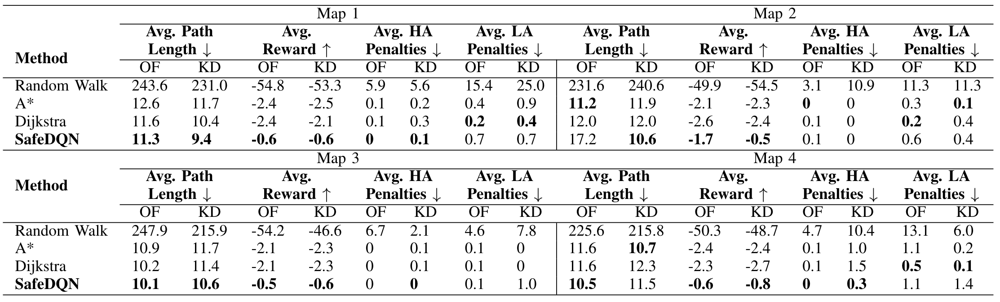

# SAFEDQN-HRI 🤖

Safety-Critical Deep Q-Learning (SafeDQN) for Mobile Robots in the Emergency Department

SafeDQN is a new acuity-aware navigation system for mobile robots (see Figure 1). SafeDQN models patient acuity by detecting the number of healthcare workers treating patients and the amount of relative motion from the healthcare workers. High-acuity patients tend to have more HCWs in attendance and those HCWs tend to move more quickly.

[[Paper]](https://www.angeliquemtaylor.com/_files/ugd/16ca55_2235df84eb4140d0923a11c2148ecd98.pdf) [[Video]](https://youtu.be/T7uzHc-RbiI)


<p align="center"> 
</img> 
</p>

<b>Figure 1:</b> SafeDQN System Architecture. SafeDQN performs acuity detection. Then, it assigns an acuity score (AS) to each observed patient in the ED and uses the AS to assign a reward to the agent. The state-action value transitions for the agent exploration are modeled by a deep Q- network, which predicts optimal Q-values to generate a path that encounters the least number of high-acuity patients.

</i> 
</p>

Contents: 
- [Introduction](#introduction) 
- [SafeDQN Overview](#overview)
- [Installation](#installation) 
- [Code Structure Overview](#code_structure_overview) 
- [Dataset Setup](docs/dataset_setup.md) 
- [Usage](#usage) 
- [Experiments](docs/experiments.md)

## Introduction

The emergency department (ED) is a safety-critical environment in which healthcare workers (HCWs) are overburdened, overworked, and have limited resources, especially during the COVID-19 pandemic. One way to address this problem is to explore the use of robots that can support clinical teams, e.g., to deliver materials or restock supplies. However, due to EDs being overcrowded, and the cognitive overload that HCWs' experience, robots need to understand various levels of patient acuity so they avoid disrupting care delivery. In this paper, we introduce the Safety-Critical Deep Q-Network (SafeDQN) system, a new acuity-aware navigation system for mobile robots. SafeDQN is based on two insights about care in EDs: high-acuity patients tend to have more HCWs in attendance and those HCWs tend to move more quickly. We compared SafeDQN to three classic navigation methods, and show that it generates the safest, quickest path for mobile robots when navigating in a simulated ED environment. We hope this work encourages future exploration of social robots that work in safety-critical, human-centered environments, and ultimately help to improve patient outcomes and save lives captured from a mobile  robot.

 If you would like to cite this work: 

Taylor, A., Matsumoto, S., Xiao, W., & Riek, L. D. (2021). Social navigation for mobile robots in the emergency department. In 2021 IEEE International Conference on Robotics and Automation (ICRA) (pp. 3510-3516). IEEE.

``` 
@inproceedings{taylor2021social,
  title={Social navigation for mobile robots in the emergency department},
  author={Taylor, Angelique and Matsumoto, Sachiko and Xiao, Wesley and Riek, Laurel D},
  booktitle={2021 IEEE International Conference on Robotics and Automation (ICRA)},
  pages={3510--3516},
  year={2021},
  organization={IEEE}
}
```

## SafeDQN Overview


### Action space 

The agent may only choose to go up, down, left, right, or query (pedestrians). 

### Observation space 

The observation space are YouTube videos which contain either safety-critical patient training videos or videos of social interaction. This represents when patients are being treated in the ED hallways and when they collaborate on patient care. 

### Reward 

A reward of +10 is given when the agent reaches the goal, -0.5 for entering a warning zone, -1 for entering a high-acuity patient critical zone, otherwise the agent receives a reward of -0.1/(number of cells). 

### End condition 

The map is reset when the agent reaches the goal. 

### Using our OpenAI Environment 

We use [OpenAI Gym](https://gym.openai.com/) for our reinforcement learning agent. 

### Pre-generated Map Versions * 12 cells x 12 cells


<p align="center"> 
</img> 
</p>

<b>Figure 3:</b> Maps of the environment used to train SafeDQN. We used a single block easy (Map 1) and hard map (Map 2), and a double block easy (Map 3) and hard map (Map 4).

## Installation 

### Install SafeDQN & Prerequisites with pip (Optional 1)


You can install the dependencies with `pip`: 
``` 
git clone https://github.com/UCSD-RHC-Lab/safedqn-hri.git 
cd safedqn-hri
pip install opencv-python
pip install matplotlib
pip install pandas
pip install collection
pip install argparse
pip install ipython
pip install numpy==1.18 
pip install scipy==1.1.0 
```

# Install SafeDQN & Prerequisites with Miniconda (Optional 2)

```
git clone https://github.com/UCSD-RHC-Lab/safedqn-hri.git 
cd safedqn-hri 
pip install -e . 
``` 
The code is compatible with Python 2.7 and 3.4+. SafeDQN was tested on Mac and Ubuntu machines. The other dependencies are needed to run the agent: 

* [keras with tensorflow backend](https://keras.io/) 
* [tensorflow 2.0](https://www.tensorflow.org/install) 
* Ubuntu 16.04 [CUDA10](https://www.tensorflow.org/install/gpu) 

# Install OpenAI Gym (Optional 1): 

Installs miniconda and installs dependencies via conda ```bash setup.sh ``` 
# Install [OpenAI Gym](https://gym.openai.com/) 
```
git clone https://github.com/openai/gym.git 
cd gym 
pip install -e . 
pip install gym 
``` 

# Building OpenAI Gym from Source (Optional 2): 
```
git clone https://github.com/openai/gym 
cd gym 
pip install -e . 
``` 

# Use Our OpenAI Gym Environment 
```
import gym import ed_grid env = gym.make('ed-grid-v0')
 ``` 

## Dataset Setup

The Emergency Department (ED) dataset is a collection of YouTube videos that reflect realistic conditions in an ED. The videos show day-to-day tasks of HCWs, and reflect how dynamic, chaotic, and crowded it can be (See Fig. 3). We used the following search terms on YouTube: “emergency medicine trauma,” “gunshot wound trauma,” “heart attack trauma,” “traumatic injuries emergency department,” “Untold Stories of the E.R.,” “Trauma: Life in the E.R.,” “Emergency Room: Life + Death at VGH,” “Boston Med,” “Hopkins,” “Save my life,” “NY Med,” “The Critical Hour,” “Boston EMS,” “Big Medicine,” and “medical documentaries.”

After collecting videos, we reviewed them to ensure they contained clinical activities. We then removed image sequences that did not show patient treatment. Next, we split all videos to create fixed, uniform segments of 100 images each. Segments consisting of less than 100 images were adjusted to the appropriate length by applying circular padding. The final dataset contains 689 videos.

Each video was labeled with the maximum number of people along with two velocity measures, optical flow (OF) [34] and a keypoint detector (KD) [35] as these are commonly used methods in the literature. In order to generate a velocity measurement using the keypoint detector, we use the temporal difference of keypoints throughout the video.

We calculated the number of people in each video using the pedestrian detector from [33], which we used to classify videos as low or high-acuity. 550 videos were labeled as low-acuity and 139 videos were labeled as high-acuity.

# Install Dataset 

To install the dataset, download it from this [Google Drive](https://drive.google.com/drive/folders/17wATVRmqyeKAVKh0kpGYhSUx7y2kLkG8?usp=sharing) folder and store in the data folder.

# Generate Map Configuration Files

SafeDQN requires a map configuration file (.csv file) to train and test the planner. The configuration file that contains: 

- acuity_score: number ranging from 0 to 1 which is low- and high-acuity patient observed
- config_num: map configuration number
- keypoint: measure of relative motion using keypoint detection from [OpenCV](https://docs.opencv.org/4.x/d2/d29/classcv_1_1KeyPoint.html)
- optical_flow: measure of relative motion using optical flow from [OpenCV](https://docs.opencv.org/3.4/d4/dee/tutorial_optical_flow.html)
- max_num_people: maximum number of people generated from [YOLO pedestrian detector](https://opencv-tutorial.readthedocs.io/en/latest/yolo/yolo.html).
- robot_col: randomly initialize robot column 
- robot_row: randomly initialize robot row 
- segment_number: segment number from the dataset
- video_name: raw video name from [YouTube](https://www.youtube.com/).


``` 
cd safedqn-hri 
cd datasets/list/ 
bash generate_image_lists.sh 
cd ../../scripts/ 
bash run_generate_map_configuration.sh
```
Additional libraries to install:

- [Tensorflow](https://www.tensorflow.org/install/pip#virtual-environment-install)

## Code Structure Overview

`safedqn-hri` contains: 

`learning/`: store agent navigation methods
- `safedqn.py`: runs SafeDQN planner
- `a_star.py`: runs A* Search algorithm
- `dijkstra.py`: runs dijkstra's shortest path algorithm

`ed_grid/`: stores the Open-AI Gym environment for agent navigation among low and high acuity patients

`scripts/`: scripts that run experiments (e.g., run_qnn_sgd_test.sh), generate configuration files for video acuity scores (e.g., generate_map_configurations_updated.py), and run comparative methods on ed maps (e.g., run_comparative_methods.sh)
- `map_config/`: folder that contains map configuration files

`models/`: directory where models are stored

`data/`: where the input video image data is stored
- download data from this [Google Drive](https://drive.google.com/drive/folders/17wATVRmqyeKAVKh0kpGYhSUx7y2kLkG8?usp=sharing) folder and store here

`figures/`: store figures generated from experiments 

`docs/`: 
- `dataset_setup`: describes data setup 
- `experiments`: describes navigation experiments described in the paper

`images/`: stores images used on the GitHub repository

## Usage

### Running SafeDQN with map configuration file. 

The basic structure of our commands is the following: 

`python learning/safedqn_agent.py --mode=<mode> --gamma=<gamma> --map_num=<map_num> --alpha=<alpha> --n_episodes=<n_episodes> --epsilon=<epsilon> --rendering=<rendering> --save_map=<save_map> --network_name=<network_name>` 

where `<mode>` is the dataset and group directory
`<gamma>` indicates whether the tracker displays the video as the tracker runs
`<map_num>` is the path to save the image data that shows group tracks (See Figure 3)
<n_episodes> is the number of episodes to run training
<epsilon> is the discount factor
<rendering> indicates when the system displays the agent's movements during training
<save_map> is the directory the store the map
<network_name> is the directory of the network

After the dataset is setup, run the safedqn on map 1 as follows:

python learning/safedqn.py --mode=QNN --gamma=0.99 --map_num=1 --alpha=0.0001 --n_episodes=30000 --epsilon=0.9 --rendering=0 --save_map=./networks/train_map1.csv --network_name=./networks/model_train_1

Additional parameters include:

- gamma: discounting factor: controls the contribution of rewards further in the future, default=0.99
- alpha: step size or learning rate, default=0.1
- n_episodes: number of episodes, default=1000
- epsilon: with the probability epsilon, we select a random action, default=0.1
- rendering: rendering 2D grid, default=0
- map_num: map number for 2D grid of the ED. Options={1,2,3,4}, default=1 (See Figure 3)
- map_loc_filename: .csv file with location of environment variables
- video_df_filename: video dataframe filename
- network_name: neural network filename
- save_map: filename to save map configuration
- exploration_mode: options include {'random','eta-greedy','ucb1'}, default='eta-greedy'
- C: exploration param for UCB1, 0-no exploration, 1-exploration, default=1

### Train SafeDQN Deep Q-Network

To train SafeDQN on map 1, run the following command in the terminal
``` 
python learning/safedqn_agent.py --mode=QNN --gamma=0.99 --map_num=1 --alpha=0.0001 --n_episodes=30000 --epsilon=0.9 --rendering=0 --save_map=./networks/train_map1.csv --network_name=./networks/model_train_1
```

### Test SafeDQN 

To test SafeDQN on map 1, run the following command in the terminal
``` 
python learning/safedqn_agent.py --gamma=0.95 --map_num=1 --alpha=0.0001 --n_episodes=50 --epsilon=0.1 --rendering=0 --save_map=./networks/train_of_map1.csv --video_df_filename=./scripts/map_config/optical_flow_train_map1_config.csv --mode=test --optimizer=SGD --motion_estimation=of
```
### Alternate Path Planners

In our experiments, we compared SafeDQN to A* Search, Dijkstra, and Random path planners. 

Navigation Methods: 

- `a_star.py` to run A* Search shortest path method with optical flow for 100 trials
``` 
python learning/scdqn_compare.py --mode=a_star --motion_estimation=of --n_episodes=100 
```

- `dijkstra.py` to run Dijkstra's shortest path method with optical flow for 100 trials
``` 
python learning/scdqn_compare.py --mode=dijkstras --motion_estimation=of --n_episodes=100
```

Additional parameters include:

- mode: run 'a_star' or 'dijkstra' method
- motion_estimation: use optical flow 'of' or keypoint detection 'kd'
- n_episodes: number of episodes/trials to run shortest path methods, default=100


### Additional commands

This should generate the results figures that can be found in our paper. 

Results from experiments: 

<p align="center"> 
</img> 
</p>


<b>Figure 4:</b> Comparison between SafeDQN variants and Random Walk, A* search [1], and Dijkstra’s [2] shortest path methods over 100 iterations where ↑ means higher is better and ↓ means lower is better. We compare the optical flow (OP) [3] and keypoint detection (KD) [4] methods which we used to determine the number of low and high acuity patients for each map. We ran all methods on four maps which have single and double block hallways (See Fig. 3).

[1] P. E. Hart, N. J. Nilsson, and B. Raphael, “A formal basis for the heuristic determination of minimum cost paths,” IEEE transactions on Systems Science and Cybernetics, vol. 4, no. 2, pp. 100–107, 1968.

[2] E. W. Dijkstra et al., “A note on two problems in connexion with graphs,” Numerische mathematik, vol. 1, no. 1, pp. 269–271, 1959.

[3] S. S. Beauchemin and J. L. Barron, “The computation of optical flow,” ACM computing surveys (CSUR), vol. 27, no. 3, pp. 433–466, 1995.

[4] E. Rublee, V. Rabaud, K. Konolige, and G. Bradski, “Orb: An efficient alternative to sift or surf,” in 2011 International conference on computer vision. Ieee, 2011, pp. 2564–2571.


